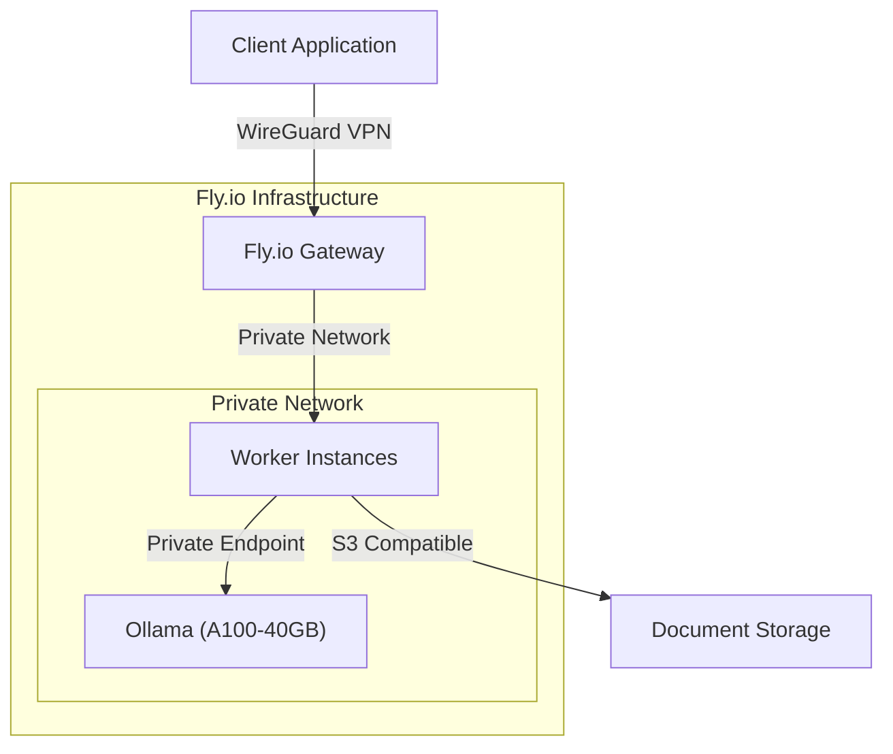
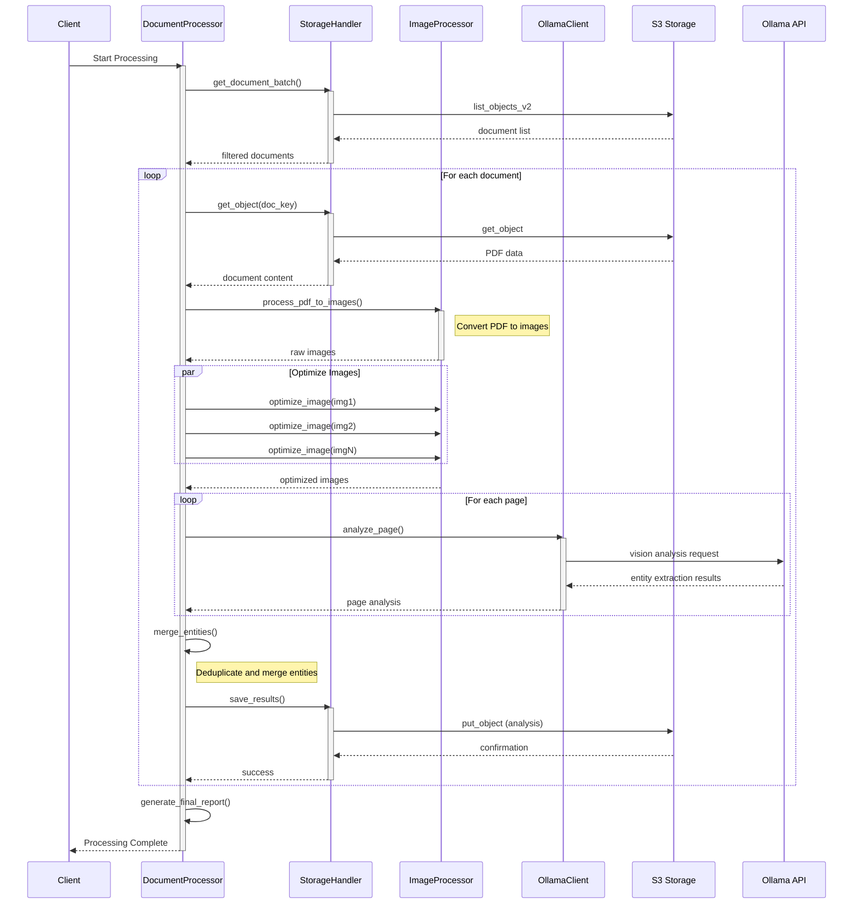

# Secure Document Processing with Private Ollama Endpoints

This system provides a secure, serverless solution for processing sensitive documents using Ollama's vision capabilities. It leverages Fly.io's GPU-enabled infrastructure, WireGuard for secure networking, and integrates with S3-compatible storage systems.

## Architecture Overview
### Deployment

### Data Processing Flow


## Quick Setup Guide

### Prerequisites
- Fly.io account and CLI installed
- Python 3.12 or higher
- S3-compatible storage access
- Git installed

### Initial Deployment

1. Clone and initialize the project:
```bash
git clone https://github.com/Eden-Advisory/private-endpoint-gpu-serverless.git
cd private-endpoint-gpu-serverless
uv venv
source .venv/bin/activate
uv pip install -r requirements.txt
```

2. Deploy Ollama service:
```bash
fly launch --no-deploy
fly ips allocate-v6 --private
```

3. Create your fly.toml:
```toml
app = 'ollama-serverless'
primary_region = 'ord'

[build]
  image = 'ollama/ollama'

[[mounts]]
  source = 'models'
  destination = '/root/.ollama'
  initial_size = '100gb'

[http_service]
  internal_port = 11434
  auto_stop_machines = 'stop'
  auto_start_machines = true
  min_machines_running = 0
  processes = ['app']

[[vm]]
  size = 'a100-40gb'
  memory = '32gb'
  cpu_kind = 'performance'
  cpus = 8
```

4. Deploy and start the Ollama instance:
```bash
fly deploy
fly machine run -e OLLAMA_HOST=http://ollama-serverless.flycast --shell ollama/ollama
```

### Configuration

Create a .env file with your environment settings:
```env
# Storage Settings
AWS_ACCESS_KEY_ID=your_storage_access_key
AWS_SECRET_ACCESS_KEY=your_storage_secret_key
AWS_ENDPOINT_URL_S3=https://storage.endpoint
AWS_ENDPOINT_URL_IAM=https://iam.endpoint
AWS_REGION=auto

# Processing Settings
BATCH_SIZE=50
MAX_CONCURRENT_BATCHES=4
OUTPUT_DIR=./output
OLLAMA_ENDPOINT=http://ollama-serverless.flycast:11434

# Resource Configuration
MEMORY_LIMIT=32G
MAX_CPU_CORES=8
```

## Worker Implementation

The worker system processes documents through several stages:

1. Document Retrieval: Files are fetched from S3-compatible storage using configured credentials and endpoints.

2. Image Processing: PDFs are converted to optimized images suitable for vision processing.

3. Entity Extraction: Each page is analyzed using Ollama's vision capabilities to extract entities such as organizations, locations, people, and dates.

4. Result Aggregation: Entities are merged across pages with duplicate detection and reference tracking.

Start the worker:
```bash
python3 worker.py
```

## Security Implementation

The system implements several security measures:

1. Network Security
   - Private networking through Fly.io
   - WireGuard VPN for encrypted communications
   - Isolated processing environment
   - Access control through Fly.io's security features

2. Data Protection
   - Secure credential management
   - Temporary file cleanup
   - Access logging
   - Input validation and sanitization

## Resource Management

The system effectively manages computational resources:

1. GPU Utilization
   - A100-40GB GPU allocation for vision processing
   - Automatic scaling based on workload
   - Cost optimization through auto-stop features

2. Memory Management
   - 32GB RAM allocation
   - Efficient batch processing
   - Automatic cleanup of processed files

## Monitoring and Maintenance

The system provides detailed operational insights:

1. Processing Metrics
   - Document throughput rates
   - Entity extraction statistics
   - Error rates and types
   - Resource utilization

2. System Health
   - GPU utilization metrics
   - Memory usage tracking
   - Network performance
   - Storage access statistics

## Performance Optimization

The worker implements several optimization strategies:

1. Concurrent Processing
   - Multi-threaded document retrieval
   - Parallel image processing
   - Batch entity extraction
   - Asynchronous result writing

2. Resource Efficiency
   - Automatic batch size adjustment
   - Memory-efficient file handling
   - Optimized image processing
   - Intelligent retry mechanisms

## Troubleshooting

Common issues and their solutions:

1. Connection Issues
   - Verify Fly.io service status
   - Check WireGuard configuration
   - Validate storage credentials
   - Confirm network settings

2. Processing Errors
   - Validate document formats
   - Check storage permissions
   - Review resource allocation
   - Examine error logs

## Development and Contributing

For development:

1. Fork the repository
2. Create a feature branch
3. Implement changes
4. Submit a pull request

Please maintain:
- Comprehensive documentation
- Test coverage
- Code style consistency
- Security best practices

## Support

For support:
1. Review documentation
2. Check issue tracker
3. Contact system administrators
4. Submit detailed bug reports

## Acknowledgments

This project builds on:
- Ollama's vision processing capabilities
- Fly.io's serverless infrastructure
- Python's async processing features
- Community-contributed improvements